<!-- This file is generated by npm run graph:dependencies. Do not edit manually. -->

# Application dependency maps

The application contains 50 reachable modules, 119 runtime imports and 54 type-only imports.
The generator rejects runtime dependency cycles.

## Architecture overview

Numbers on arrows are runtime import counts between layers. Imports inside one layer are collapsed.

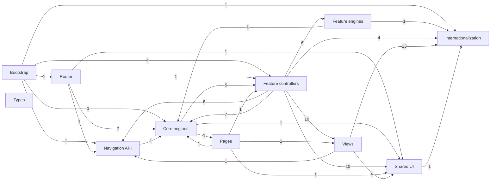

## Focused maps

Open only the area you need. Each map shows outgoing runtime imports; type-only imports are intentionally omitted.

Bootstrap and navigation

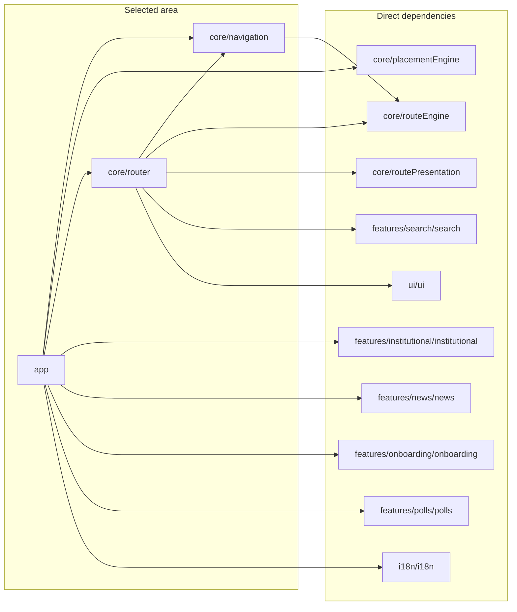

Exercises

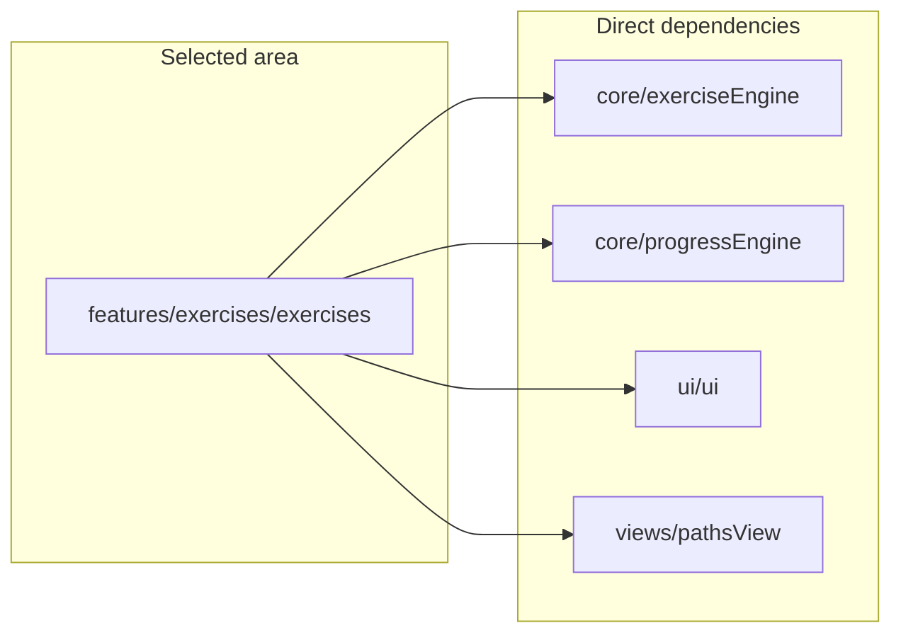

Grammar

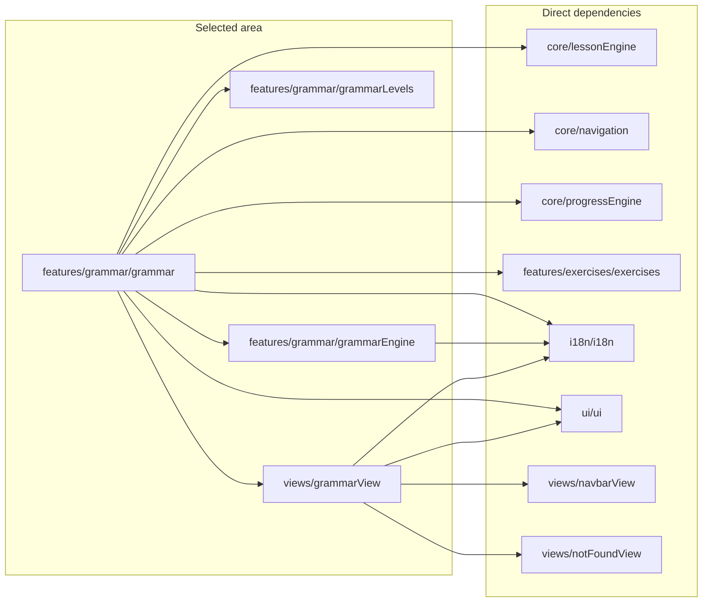

Institutional

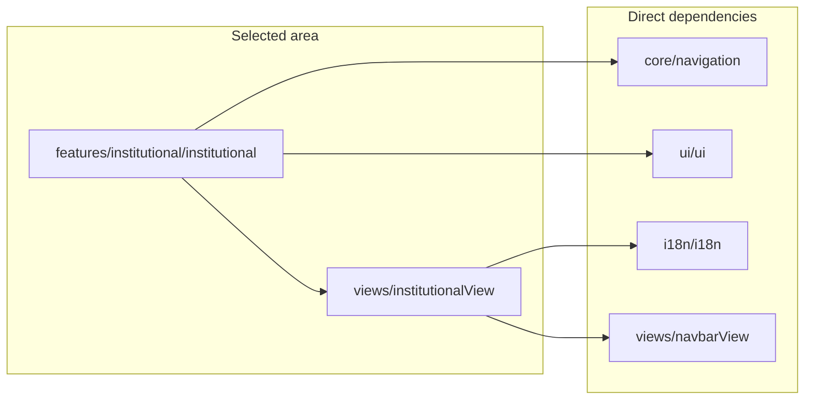

News

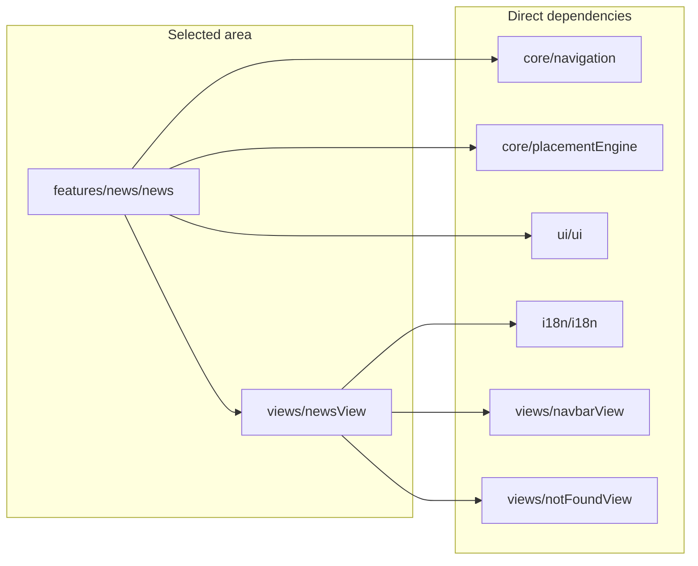

Onboarding

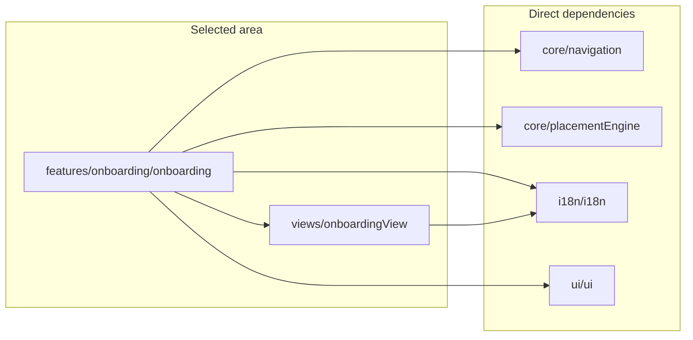

Polls

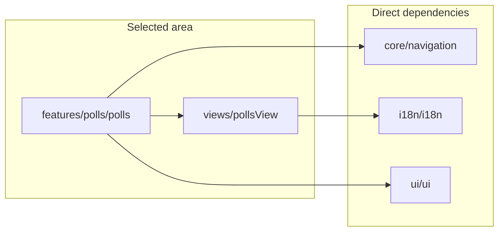

Search

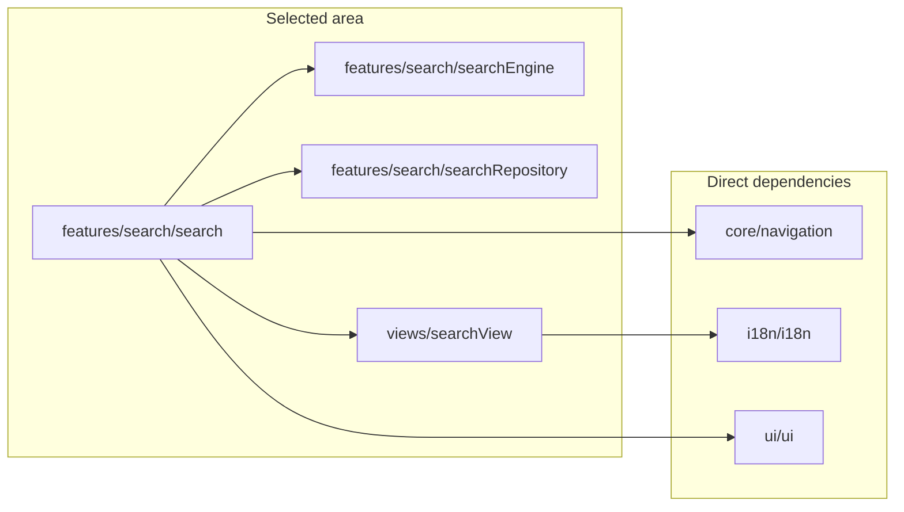

Travel

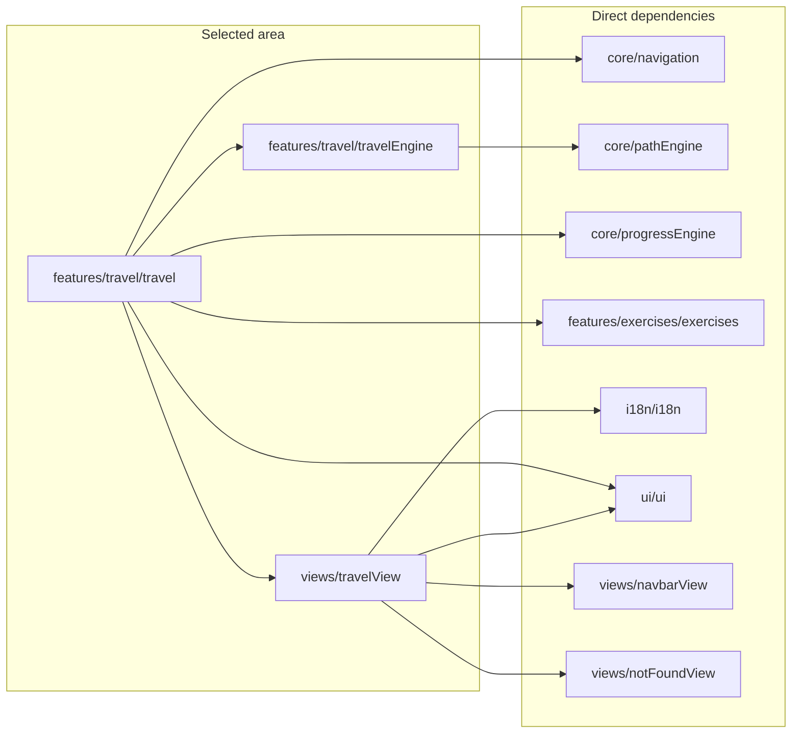

Vocabulary

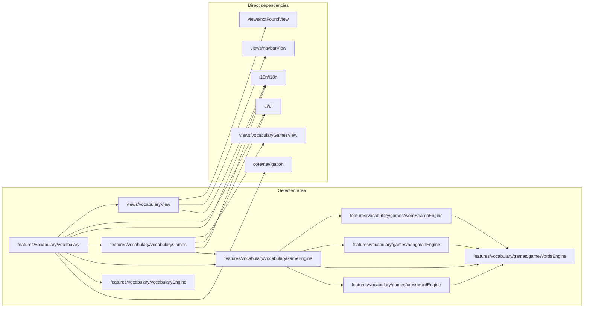

Pages and shared services

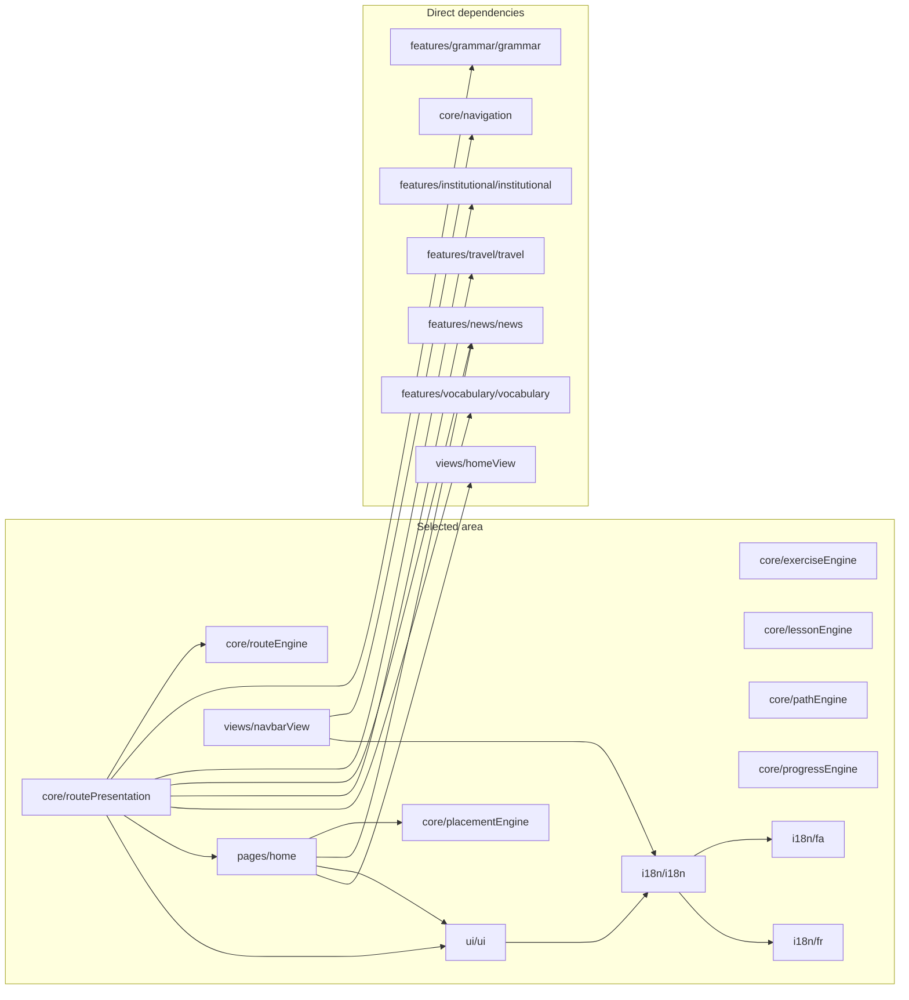

## Enforced invariants

- No runtime dependency cycle.
- 54 type-only imports are tracked but hidden from diagrams to avoid visual noise.
- Every module and edge is derived from the imports reachable from `app.ts`.
