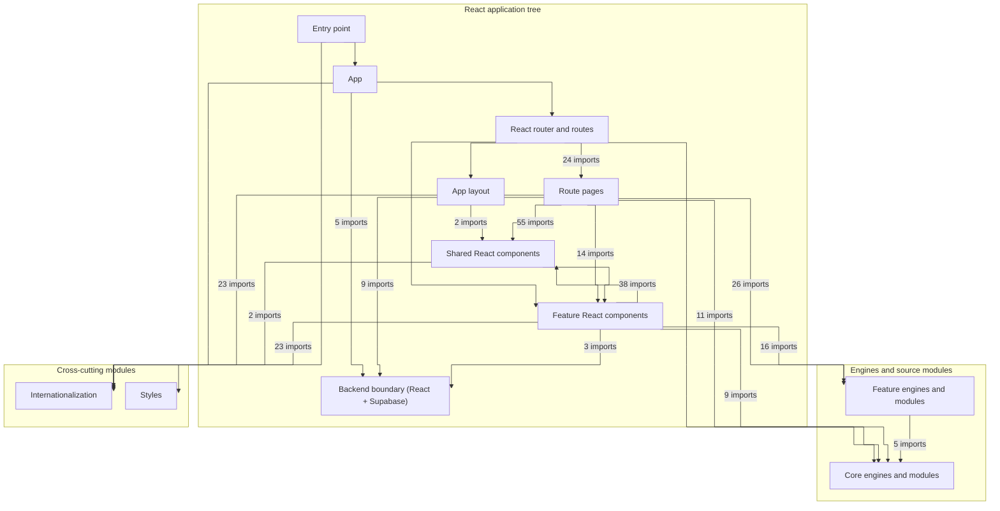
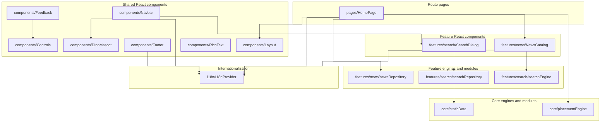
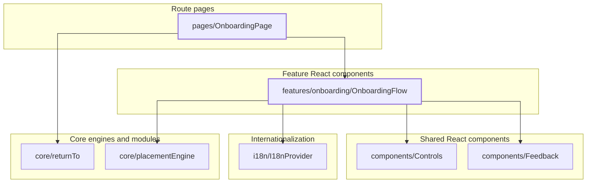
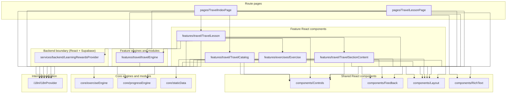
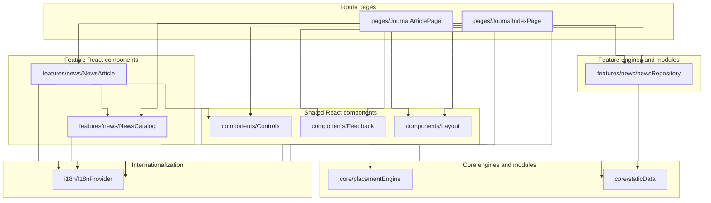
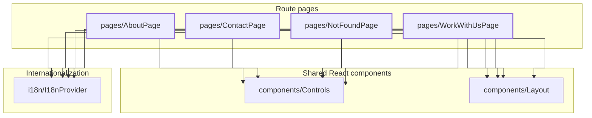

```mermaid
%%{init: {"flowchart": {"curve": "stepAfter", "nodeSpacing": 24, "rankSpacing": 42}}}%%
flowchart TB
    classDef focus stroke-width:2px
    subgraph S5["Route pages"]
        direction TB
        M0["pages/GrammarIndexPage"]:::focus
        M1["pages/GrammarLessonPage"]:::focus
        M2["pages/GrammarLevelPage"]:::focus
    end
    subgraph S6["Shared React components"]
        direction TB
        M3["components/Controls"]
        M4["components/Feedback"]
        M5["components/Layout"]
        M6["components/RichText"]
    end
    subgraph S7["Feature React components"]
        direction TB
        M7["features/exercises/Exercise"]:::focus
        M8["features/grammar/GrammarCatalog"]:::focus
        M9["features/grammar/GrammarLesson"]:::focus
        M10["features/grammar/GrammarLessonContent"]:::focus
    end
    subgraph S8["Feature engines and modules"]
        direction TB
        M11["features/grammar/grammarEngine"]:::focus
        M12["features/grammar/grammarLevels"]:::focus
        M13["features/shop/shopOfferManifest"]
    end
    subgraph S9["Core engines and modules"]
        direction TB
        M14["core/exerciseEngine"]
        M15["core/lessonEngine"]
        M16["core/progressEngine"]
        M17["core/staticData"]
    end
    subgraph S10["Internationalization"]
        direction TB
        M18["i18n/I18nProvider"]
    end
    M7 --> M14
    M7 --> M16
    M7 --> M18
    M7 --> M3
    M7 --> M4
    M7 --> M5
    M7 --> M6
    M8 --> M11
    M8 --> M13
    M8 --> M18
    M8 --> M3
    M8 --> M5
    M11 --> M17
    M9 --> M16
    M9 --> M7
    M9 --> M11
    M9 --> M10
    M9 --> M18
    M9 --> M3
    M9 --> M5
    M10 --> M18
    M10 --> M3
    M10 --> M5
    M10 --> M6
    M0 --> M12
    M0 --> M18
    M0 --> M3
    M0 --> M5
    M1 --> M15
    M1 --> M11
    M1 --> M9
    M1 --> M12
    M1 --> M18
    M1 --> M3
    M1 --> M4
    M1 --> M5
    M2 --> M8
    M2 --> M11
    M2 --> M18
    M2 --> M3
    M2 --> M4
    M2 --> M5
```

```mermaid
%%{init: {"flowchart": {"curve": "stepAfter", "nodeSpacing": 24, "rankSpacing": 42}}}%%
flowchart TB
    classDef focus stroke-width:2px
    subgraph S5["Route pages"]
        direction TB
        M0["pages/VocabularyIndexPage"]:::focus
        M1["pages/VocabularyLevelPage"]:::focus
        M2["pages/VocabularyPackPage"]:::focus
        M3["pages/VocabularyReviewPage"]:::focus
    end
    subgraph S6["Shared React components"]
        direction TB
        M4["components/Controls"]
        M5["components/Feedback"]
        M6["components/Layout"]
        M7["components/RichText"]
    end
    subgraph S7["Feature React components"]
        direction TB
        M8["features/vocabulary/VocabularyCatalog"]:::focus
        M9["features/vocabulary/VocabularyCrossword"]:::focus
        M10["features/vocabulary/VocabularyFlashcards"]:::focus
        M11["features/vocabulary/VocabularyGame"]:::focus
        M12["features/vocabulary/VocabularyGameShell"]:::focus
        M13["features/vocabulary/VocabularyHangman"]:::focus
        M14["features/vocabulary/VocabularyPack"]:::focus
        M15["features/vocabulary/VocabularyQuiz"]:::focus
        M16["features/vocabulary/VocabularyStory"]:::focus
        M17["features/vocabulary/VocabularyWordSearch"]:::focus
    end
    subgraph S8["Feature engines and modules"]
        direction TB
        M18["features/shop/shopOfferManifest"]
        M19["features/vocabulary/games/crosswordEngine"]:::focus
        M20["features/vocabulary/games/gameWordsEngine"]:::focus
        M21["features/vocabulary/games/hangmanEngine"]:::focus
        M22["features/vocabulary/games/wordSearchEngine"]:::focus
        M23["features/vocabulary/vocabularyEngine"]:::focus
        M24["features/vocabulary/vocabularyGameEngine"]:::focus
        M25["features/vocabulary/vocabularyLevels"]:::focus
        M26["features/vocabulary/vocabularyRepository"]:::focus
    end
    subgraph S9["Core engines and modules"]
        direction TB
        M27["core/staticData"]
    end
    subgraph S10["Internationalization"]
        direction TB
        M28["i18n/I18nProvider"]
    end
    M19 --> M20
    M21 --> M20
    M22 --> M20
    M8 --> M18
    M8 --> M28
    M8 --> M4
    M8 --> M6
    M9 --> M24
    M9 --> M12
    M9 --> M28
    M9 --> M4
    M10 --> M27
    M10 --> M26
    M10 --> M28
    M10 --> M4
    M10 --> M6
    M11 --> M9
    M11 --> M13
    M11 --> M17
    M24 --> M19
    M24 --> M20
    M24 --> M21
    M24 --> M22
    M12 --> M28
    M12 --> M4
    M13 --> M24
    M13 --> M12
    M13 --> M28
    M14 --> M10
    M14 --> M11
    M14 --> M24
    M14 --> M15
    M14 --> M26
    M14 --> M16
    M14 --> M28
    M14 --> M4
    M14 --> M6
    M15 --> M28
    M15 --> M4
    M15 --> M7
    M26 --> M27
    M16 --> M23
    M16 --> M28
    M16 --> M4
    M17 --> M24
    M17 --> M12
    M17 --> M28
    M0 --> M28
    M0 --> M4
    M0 --> M6
    M1 --> M8
    M1 --> M25
    M1 --> M26
    M1 --> M28
    M1 --> M4
    M1 --> M5
    M1 --> M6
    M2 --> M25
    M2 --> M14
    M2 --> M26
    M2 --> M28
    M2 --> M4
    M2 --> M5
    M2 --> M6
    M3 --> M10
    M3 --> M25
    M3 --> M26
    M3 --> M28
    M3 --> M5
    M3 --> M6
```

<!-- This file is generated by npm run graph:dependencies. Do not edit manually. -->

# React application dependency maps

The application contains 102 local modules reachable from `src/main.tsx`, 316 runtime imports and 89 type-only imports.
The generator rejects runtime dependency cycles.

## React architecture overview

Arrows follow runtime imports from the React entry point down to routes, layouts, pages, components, features, engines and source modules. Counts are shown only when several imports cross the same two layers; imports inside one layer are collapsed.

## React root and route tree

This is the concrete top of the import tree. A thicker node border marks the files selected for this view; their direct local dependencies remain visible in the layer where they belong.

```mermaid
%%{init: {"flowchart": {"curve": "stepAfter", "nodeSpacing": 24, "rankSpacing": 42}}}%%
flowchart TB
    classDef focus stroke-width:2px
    subgraph S0["Entry point"]
        direction TB
        M0["main"]:::focus
    end
    subgraph S1["App"]
        direction TB
        M1["app/App"]:::focus
    end
    subgraph S2["Backend boundary (React + Supabase)"]
        direction TB
        M2["services/backend/AuthProvider"]
        M3["services/backend/BackendProvider"]
        M4["services/backend/LearnerProfileProvider"]
        M5["services/backend/LearningRewardsProvider"]
        M6["services/backend/ShopProvider"]
    end
    subgraph S3["React router and routes"]
        direction TB
        M7["app/AppRouter"]:::focus
        M8["app/routes"]:::focus
    end
    subgraph S4["App layout"]
        direction TB
        M9["app/AppLayout"]:::focus
    end
    subgraph S5["Route pages"]
        direction TB
        M10["pages/AboutPage"]
        M11["pages/AuthPage"]
        M12["pages/ContactPage"]
        M13["pages/GrammarIndexPage"]
        M14["pages/GrammarLessonPage"]
        M15["pages/GrammarLevelPage"]
        M16["pages/HomePage"]
        M17["pages/JournalArticlePage"]
        M18["pages/JournalIndexPage"]
        M19["pages/NotFoundPage"]
        M20["pages/OnboardingPage"]
        M21["pages/PracticeCatalogPage"]
        M22["pages/PracticeGamePage"]
        M23["pages/PracticeIndexPage"]
        M24["pages/PracticeReviewPage"]
        M25["pages/ProfilePage"]
        M26["pages/ShopPage"]
        M27["pages/TravelIndexPage"]
        M28["pages/TravelLessonPage"]
        M29["pages/VocabularyIndexPage"]
        M30["pages/VocabularyLevelPage"]
        M31["pages/VocabularyPackPage"]
        M32["pages/VocabularyReviewPage"]
        M33["pages/WorkWithUsPage"]
    end
    subgraph S6["Shared React components"]
        direction TB
        M34["components/Footer"]
        M35["components/Navbar"]
    end
    subgraph S7["Feature React components"]
        direction TB
        M36["features/shop/LessonAccessBoundary"]
    end
    subgraph S9["Core engines and modules"]
        direction TB
        M37["core/returnTo"]
    end
    subgraph S10["Internationalization"]
        direction TB
        M38["i18n/I18nProvider"]
    end
    subgraph S12["Styles"]
        direction TB
        M39["styles/style"]
    end
    M1 --> M7
    M1 --> M38
    M1 --> M2
    M1 --> M3
    M1 --> M4
    M1 --> M5
    M1 --> M6
    M9 --> M34
    M9 --> M35
    M7 --> M9
    M7 --> M8
    M7 --> M37
    M7 --> M36
    M7 --> M10
    M7 --> M11
    M7 --> M12
    M7 --> M13
    M7 --> M14
    M7 --> M15
    M7 --> M16
    M7 --> M17
    M7 --> M18
    M7 --> M19
    M7 --> M20
    M7 --> M21
    M7 --> M22
    M7 --> M23
    M7 --> M24
    M7 --> M25
    M7 --> M26
    M7 --> M27
    M7 --> M28
    M7 --> M29
    M7 --> M30
    M7 --> M31
    M7 --> M32
    M7 --> M33
    M0 --> M1
    M0 --> M39
```

## Focused route branches

Open only the branch you need. Each map follows outgoing runtime imports from its highlighted React pages and feature components into shared components, engines and modules. Type-only imports are intentionally omitted.

Home, navigation and search

Grammar

Onboarding

Travel

Vocabulary

Journal

Institutional pages

## Enforced invariants

- No runtime dependency cycle.
- 89 type-only imports are tracked but hidden from diagrams to avoid visual noise.
- Every module and edge is derived from the local imports reachable from `src/main.tsx`.
- External packages are intentionally excluded so the diagrams stay focused on application architecture.
